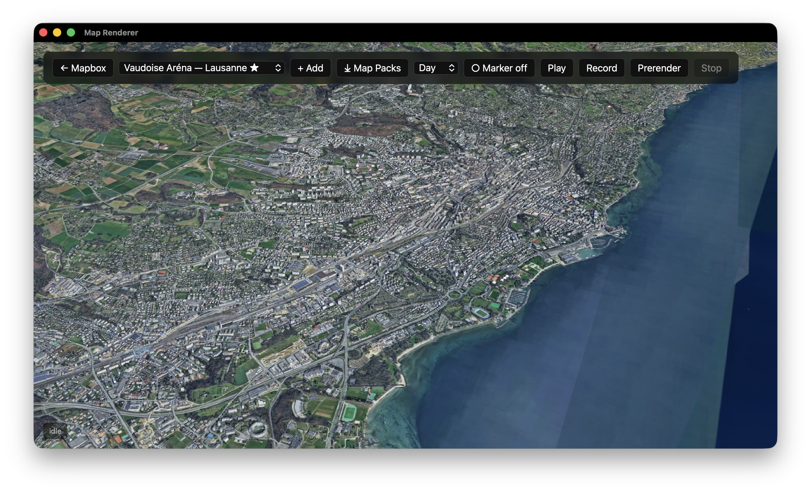

# Map Renderer

**Broadcast-style 3D map flyovers, scriptable and renderable to video.**

A desktop / web app that produces "virtual fly-in" animations — the kind you see used as locator graphics for sports broadcasts, where the camera sweeps from an aerial view down to a specific stadium, arena, or landmark. Built for in-house R&D at Brutal Güet AG.



*Above: the Tauri desktop app, Cesium engine, photorealistic 3D tiles of Lausanne over Lake Geneva. Vaudoise Aréna is the active locator; the toolbar exposes locator selection, custom-location entry, light-preset, marker toggle, playback, video recording and deterministic prerender.*

---

## What it does

Pick or define a target (lat/lng → "Vaudoise Aréna", "Wankdorf Stadion", or any custom point) and the app produces a cinematic camera path that flies from ~200 km out down to ~100 m above the target, settles, and orbits. The flyover is:

- **Programmable**: every locator is a JSON file with keyframes for `{lng, lat, zoom, bearing, pitch}` plus `orbit` and `lightPreset` settings.
- **Terrain-aware**: keyframes are validated against real elevation data so the camera never clips a hill or mountain.
- **Two-engine**: the same locator JSON drives either **Mapbox GL JS v3** (satellite + 3D buildings, fully cacheable) or **Cesium + Google Photorealistic 3D Tiles** (photogrammetry meshes, broadcast-grade visuals).
- **Renderable**: live record to WebM via `MediaRecorder`, or run a deterministic frame-by-frame prerender that waits for tiles to fully load before each PNG, then mux to MP4 with ffmpeg.

---

## Features

### Camera & motion
- Catmull-Rom interpolation across keyframes with bearing-unwrapping (no flips at the 360° wrap).
- Smoothstep easing on the main flyover; quadratic ease-in / ease-out on the orbit so the transition from arrival to rotation has zero velocity discontinuity.
- Final camera pose enforced at **100 m altitude above target, 100 m horizontal offset, 45° pitch** regardless of input keyframes.
- Per-locator orbit phase (default 14 s, 360°) — the camera rotates around the target after the fly-in instead of cutting.

### Locations
- Built-in Premier League stadiums (Emirates, Anfield) and a roster of Swiss venues: Vaudoise Aréna, Stade de la Tuilière, PostFinance Arena, Stadion Wankdorf, St. Jakob-Park, Letzigrund, Swiss Life Arena, Hallenstadion, Stade de Genève, Lonza Arena (Visp).
- **+ Add** modal: pick a preset, or type any lat/lng for a generated flyover.
- User locators persist in `localStorage`.

### Terrain safety
On every locator load, an auto-pass guarantees the camera stays **≥ 100 m above the target's ground**. For user-added locators, the Add flow also performs a full path-clearance check against the Google Elevation API: ~25 probe points along the camera path are sampled, and any keyframe whose camera would be within 100 m of terrain underneath gets lifted (zoom reduced) until clear. The iteration is bounded and converges in 1–3 passes.

### Marker
A toggleable red pin at the target — visible during fly-in and orbit. Three.js mesh (cylinder + sphere + emissive ring) on the Mapbox engine; a `Cesium.Entity` polyline + point on the Cesium engine.

### Lighting / time-of-day
**Day / Dusk / Dawn / Night** dropdown. On Mapbox it switches the Standard style's `lightPreset` config — dramatic visual difference. On Cesium it advances the scene clock to a representative hour and enables globe lighting (subtle effect — Google's photoreal tiles are baked daytime imagery).

### Capture
- **Record**: live WebM via `canvas.captureStream(fps)` + `MediaRecorder`. Quick and easy, ~30 fps real-time.
- **Prerender**: deterministic. Steps the timeline frame-by-frame, waits for all tiles to fully stabilize at each frame (10 consecutive stable RAFs with no in-flight requests), then `canvas.toBlob()` to PNG, saved directly to a folder via the File System Access API. The pack ships with an `encode.sh` and a `render.json` manifest. Stitch with:
  ```bash
  ffmpeg -framerate 30 -i frame_%06d.png \
         -c:v libx264 -pix_fmt yuv420p -crf 16 -preset slow \
         -movflags +faststart output.mp4
  ```
- Chromium-only on the prerender path (uses `showDirectoryPicker`).

---

## Tech stack

| Layer | Tech |
|---|---|
| Frontend | Vite + TypeScript |
| Maps (engine A) | [Mapbox GL JS v3](https://docs.mapbox.com/mapbox-gl-js/) — Standard / Standard-Satellite style, 3D terrain DEM, native 3D buildings |
| Maps (engine B) | [CesiumJS](https://cesium.com/cesiumjs/) + [Google Photorealistic 3D Tiles](https://developers.google.com/maps/documentation/tile/3d-tiles-overview) |
| 3D primitives | [Three.js](https://threejs.org/) (custom Mapbox layer) |
| Desktop shell | [Tauri 2](https://tauri.app/) (Rust + system WebView) |
| Elevation | [Google Maps Elevation API](https://developers.google.com/maps/documentation/elevation/) |
| Recording | `MediaRecorder` (WebM) + `ffmpeg` for MP4 muxing |

---

## Setup

### Prerequisites
- **Node.js ≥ 18**
- **Rust** (only if building the desktop app — `curl --proto '=https' --tlsv1.2 -sSf https://sh.rustup.rs | sh`)
- **Xcode Command Line Tools** on macOS (`xcode-select --install`) for the Tauri build

### Install
```bash
git clone https://github.com/alexandermalinsky-brutal-guet-ag/Map-Renderer.git
cd Map-Renderer
npm install
```

### API keys
Copy `.env.example` to `.env` and fill in:

```env
VITE_MAPBOX_TOKEN=pk.your_mapbox_public_token
VITE_GOOGLE_MAPS_API_KEY=your_google_maps_api_key
```

- Mapbox token: free tier at [account.mapbox.com](https://account.mapbox.com/) — needs default scopes.
- Google Maps key: [Google Cloud Console](https://console.cloud.google.com/apis/credentials). Enable both **Map Tiles API** (for Cesium) and **Elevation API** (for terrain safety). Restrict the key to `http://localhost:*/*` and `tauri://*` referrers in dev, and to your shipping domain later.

### Run

**Web (fastest iteration, no Rust compile):**
```bash
npm run dev
# → http://localhost:5173/         (Mapbox engine)
# → http://localhost:5173/cesium.html  (Cesium + Google 3D Tiles)
```

**Desktop (Tauri):**
```bash
npm run tauri:dev
```

The first Tauri launch compiles ~400 Rust crates (5–10 min). Subsequent launches are ~10 s.

### Build production .dmg / .app / .exe
```bash
npm run tauri:build
```
Outputs to `src-tauri/target/release/bundle/`. Build will fail at the icon step unless you have `src-tauri/icons/*.png` populated — placeholder red squares are generated by `node scripts/gen-icons.mjs`.

---

## Usage walkthrough

1. **Launch** the app (web or desktop).
2. Pick a locator from the dropdown, or click **+ Add** to enter custom coordinates / pick a preset.
3. Pick a light preset (**Day / Dusk / Dawn / Night**) — has the strongest effect on the Mapbox engine.
4. Toggle the red marker if you want a pin on the target.
5. Click **Play** to preview the flyover.
6. Click **Record** to capture a live WebM (uses `MediaRecorder`).
7. For broadcast-quality output, click **Prerender** instead. A folder picker appears; pick a clean empty folder. The app then steps frame-by-frame, waits for tiles to fully load at each one, writes `frame_NNNNNN.png` plus `render.json` and `encode.sh`. When done, `cd` into that folder and run `bash encode.sh`.

---

## Architecture

### Entry points
- `src/main.ts` — Mapbox engine entry (`index.html`).
- `src/cesium-main.ts` — Cesium engine entry (`cesium.html`).

### Core modules
- `src/path.ts` — keyframe interpolation (Catmull-Rom) + orbit easing + total-duration math.
- `src/generateFlyover.ts` — given a target lng/lat, produces a 5-keyframe NW-approach path ending in the canonical 100 m / 100 m / 45° pose.
- `src/terrainSafety.ts` — local min-altitude enforcement (no API), and API-driven full-path terrain clearance via Google Elevation.
- `src/elevation.ts` — batched Google Elevation API client.
- `src/threeLayer.ts` — Mapbox custom layer that renders the red marker via Three.js.
- `src/recorder.ts` — `MediaRecorder` wrapper.
- `src/prerender.ts` — deterministic frame-by-frame PNG export via the File System Access API.
- `src/addLocationModal.ts` — the **+ Add** modal.
- `src/locatorStore.ts` — `localStorage` persistence for user-added locators.
- `src/presets.ts` — preset venue list.

### The two engines side-by-side

| Aspect | Mapbox | Cesium + Google 3D Tiles |
|---|---|---|
| Imagery | Mapbox Satellite (BingMaps-style aerial photography) | Photogrammetry meshes (Google Earth source data) |
| 3D buildings | Extruded footprints from OSM | True meshes with textures |
| Terrain | DEM tiles, exaggeration configurable | Built into the 3D Tileset |
| Day/Night | Strong (Standard style `lightPreset`) | Subtle (clock + scene lighting; tiles are baked) |
| Coverage | Worldwide | ~2500 cities, dense in Europe / NA / urban Asia |
| License for offline cache | ✓ Permitted under Mapbox terms (transient) | ✗ Prohibited under Google Maps Platform terms |

### Locator JSON schema

```json
{
  "id": "emirates",
  "name": "Emirates Stadium — Arsenal",
  "duration": 9,
  "fps": 30,
  "lightPreset": "day",
  "target": { "lng": -0.10862, "lat": 51.5548, "altitude": 0 },
  "keyframes": [
    { "lng": -2.50,    "lat": 53.60,    "zoom": 5.2,  "bearing": 0,  "pitch": 0  },
    { "lng": -1.20,    "lat": 52.50,    "zoom": 8.5,  "bearing": 20, "pitch": 40 },
    { "lng": -0.30,    "lat": 51.72,    "zoom": 12.0, "bearing": 40, "pitch": 60 },
    { "lng": -0.14,    "lat": 51.57,    "zoom": 15.0, "bearing": 55, "pitch": 65 },
    { "lng": -0.10862, "lat": 51.5548,  "zoom": 19.5, "bearing": 75, "pitch": 45 }
  ],
  "orbit": { "enabled": true, "durationSec": 14, "degrees": 360 }
}
```

Locator JSONs live in `public/locators/` (served by Vite as static assets).

---

## Project structure

```
Map Renderer/
├── index.html                  Mapbox entry page
├── cesium.html                 Cesium entry page
├── vite.config.ts              Vite + Cesium plugin + @internal alias
├── tsconfig.json
├── package.json
├── public/
│   └── locators/               Locator JSONs (Emirates, Anfield, …)
├── scripts/
│   ├── gen-icons.mjs           Generates placeholder Tauri icons
│   └── convert.sh              WebM → MP4 ffmpeg helper
├── src/
│   ├── main.ts                 Mapbox entry
│   ├── cesium-main.ts          Cesium entry
│   ├── path.ts                 Keyframe interpolation + orbit easing
│   ├── generateFlyover.ts      Auto path generator (single-point → flyover)
│   ├── terrainSafety.ts        Min-alt + path-clearance checks
│   ├── elevation.ts            Google Elevation API client
│   ├── threeLayer.ts           Mapbox Three.js marker custom layer
│   ├── prerender.ts            PNG sequence export
│   ├── recorder.ts             MediaRecorder wrapper
│   ├── presets.ts              Built-in venue list
│   ├── addLocationModal.ts     + Add modal
│   ├── locatorStore.ts         localStorage for user locators
│   ├── types.ts
│   └── internal-stubs/         No-op stubs for the optional Map Packs feature
└── src-tauri/                  Tauri desktop shell (Rust)
    ├── Cargo.toml
    ├── tauri.conf.json
    ├── src/main.rs
    └── icons/
```

### About `@internal`

`src/internal-stubs/` is the public no-op variant of an optional internal feature (offline tile-pack downloader). The Vite config at startup checks whether `src/internal/index.ts` exists; if it does, `@internal` resolves there (full feature); otherwise it resolves to the stub (feature off, button hidden). The public repo only ships the stubs — this is by design.

---

## Development tips

- **Mapbox tile costs**: each playback hits Mapbox tile endpoints. Standard free tier is generous (200k tile loads/month), but if you're iterating on flyovers all day, watch the dashboard.
- **Cesium photoreal tiles** cost Google Map Tiles API quota — also has a free tier but it's smaller. The free SKU pricing flips at 100k requests/month.
- **Hot reload**: Vite reloads instantly on changes, but the Tauri Rust shell only rebuilds if you change Rust code; the front-end live-reloads inside the Tauri window without restarting.
- **Type-check without running**: `npx tsc --noEmit`.
- **Stuck dev server**: `kill $(lsof -ti :5173)`.

---

## Roadmap / known limitations

- **Per-locator save/export**: user-added locators live in `localStorage` only — no export-to-JSON yet.
- **Custom 3D stadium models**: the Mapbox marker is a generic pin; loading per-locator GLB models in the Three.js layer is a planned extension.
- **Codesigning**: shipped `.app` bundles will trigger Gatekeeper warnings until signed with an Apple Developer ID — separate setup.
- **Cesium light preset** doesn't visibly affect Google tiles since the imagery is baked. Custom post-processing (night tint, bloom) would help.
- **Prerender browser support**: Chromium only (uses `showDirectoryPicker`).

---

## License

Proprietary — internal R&D project, Brutal Güet AG. Not currently licensed for redistribution.
